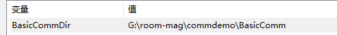
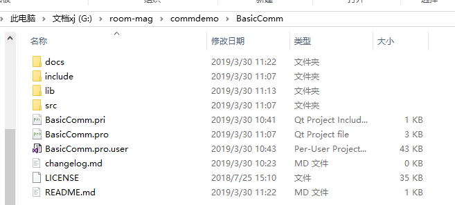
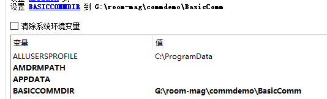

## Newly BasicComm Library

该库的文件结构被重新组织了，功能更加直观，使用该库时需要进行一些配置。库的很多配置都是参考的 [QxORM](https://github.com/QxOrm/QxOrm/)，这是一个 Qt 编写的用于 C++ 的对象关系映射库。

### 下载

首先需要下载项目到本地，以我存放的位置 `G:\room-mag\commdemo\BasicComm` 为例，后面的环境变量设置都跟这个位置有关。

### 配置

在 Windows 下添加一个用户变量 `BasicCommDir` 指向库项目文件所在位置：



项目文件中包含如下内容：

。

你也可以直接在 QtCreator 中添加构建环境的环境变量：



### 编译库

使用 QtCreator 5.7 版本及以上版本打开 BasicComm 项目 => 构建，会在 `G:\room-mag\commdemo\BasicComm\lib` 目录下生成库文件。

### 配置项目依赖

配置完 BasicComm 的环境变量后需要配置实际用到的项目文件，以 TestBasicComm 为例，修改 `TestBasicComm.pro` 文件，添加如下内容：

```
# 添加项目配置 .pri 文件
include($$(BASICCOMMDIR)/BasicComm.pri)
QT       += core gui

greaterThan(QT_MAJOR_VERSION, 4): QT += widgets

TEMPLATE = app

DEFINES += QT_DEPRECATED_WARNINGS
# 添加库
LIBS += -L"$$(BASICCOMMDIR)/lib"
CONFIG(debug, debug|release) {
    TARGET = TestBasicCommd
    # 链接到 BasicCommd 库
    LIBS += -l"BasicCommd"
} else {
    TARGET = TestBasicComm
    LIBS += -l"BasicComm"
}
```

注意：这里对 debug 和 release 两种模式做了区分，需要根据实际的项目名修改 TARGET 目标输出文件（或者注释掉，使用默认的 TARGET 名称）。